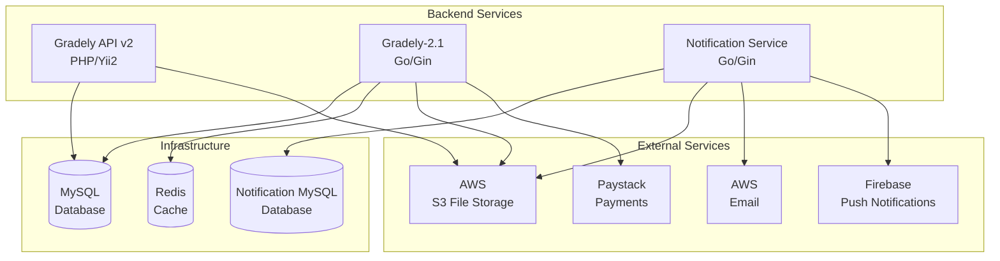

# Gradely Backend Services

Welcome to the Gradely backend services documentation! This repository serves as the central hub for understanding and integrating with the Gradely educational platform's backend architecture.

## 🏗️ Architecture Overview

Gradely's backend is built as a microservices architecture consisting of three core services that work together to provide a comprehensive educational platform:



## 🚀 Core Services

### 1. [Gradely API v2](https://github.com/gradely/gradely-api) - Legacy API Service

**Technology**: PHP 7.4+ with Yii2 Framework  
**Port**: Configurable via environment variable  
**Purpose**: Legacy API endpoints and user authentication

**Key Features**:

- User authentication and authorization
- Legacy API endpoints for backward compatibility
- Basic educational content management
- User onboarding and profile management

**Documentation**: [📁 Repository](https://github.com/gradely/gradely-api) | [🔧 Swagger UI](http://localhost:<your-port>/docs)

> **Note:** Replace `<your-port>` with the port configured in your environment variables for each service. The default ports are typically 8080 or 8081, but may vary depending on your setup.

---

### 2. [Gradely-2.1](https://github.com/gradely/gradely-2.1) - Main API Service

**Technology**: Go with Gin Framework  
**Port**: Configurable via environment variable  
**Purpose**: Core educational platform functionality

**Key Features**:

- **Authentication & Authorization**: JWT-based user management
- **Student Management**: Learning progress, homework, assessments
- **Teacher Tools**: Class management, grading, live sessions
- **Parent Dashboard**: Student monitoring and progress tracking
- **School Administration**: Multi-school management
- **Payment Processing**: Subscription and payment handling
- **Live Classes**: Real-time tutoring and live sessions
- **AI Integration**: Adaptive learning recommendations
- **Content Management**: Educational resources and libraries

**Documentation**: [📁 Repository](https://github.com/gradely/gradely-2.1) | [🔧 Swagger UI](http://localhost:<your-port>/docs)

> **Note:** Replace `<your-port>` with the port configured in your environment variables for each service. The default ports are typically 8080 or 8081, but may vary depending on your setup.

---

### 3. [Notification Service v2.1](https://github.com/gradely/notification-v2.1) - Communication Service

**Technology**: Go with Gin Framework  
**Port**: Configurable via environment variable  
**Purpose**: Multi-channel notification delivery

**Key Features**:

- **Multi-Channel Support**: Email, SMS, WhatsApp, Push notifications
- **User-Specific Notifications**: Parents, Teachers, Students, Schools
- **Template System**: HTML and text email templates
- **Blacklist Management**: User preference handling
- **Firebase Integration**: Push notifications
- **Third-Party Integrations**: Twilio, Termii
- **Background Processing**: Asynchronous notification delivery

**Documentation**: [📁 Repository](https://github.com/gradely/notification-v2.1) | [🔧 Swagger UI](http://localhost:<your-port>/docs)

> **Note:** Replace `<your-port>` with the port configured in your environment variables for each service. The default ports are typically 8080 or 8081, but may vary depending on your setup.

## 🔄 Service Communication

### API Flow

1. **All services** → **MySQL** (shared database)
2. **Gradely-2.1** → **Redis** (caching/session management)
3. **Gradely-2.1** → **Notification Service** (User notifications)
4. **Gradely-2.1** → **External Services** (Payments, Storage, etc.)

### Integration Patterns

#### Gradely-2.1 → Notification Service

```go
// Example: Sending a notification from Gradely-2.1
notification := &NotificationModel{
    ActionName: "new_homework_parent",
    ReceiverID: "12345",
    ActionData: map[string]interface{}{
        "student_name": "John Doe",
        "subject": "Mathematics",
        "homework_title": "Algebra Practice",
        "due_date": "2024-01-15",
        "teacher_name": "Mrs. Smith",
    },
}

err := notification.SendNotification(config)
```

#### HTTP Endpoints

- **Notification Service**: `POST /notification/v2.1/`
- **Blacklist Check**: `POST /notification/v2.1/check-blacklist-contact`
- **Test Notifications**: `POST /notification/v2.1/test`

## 🛠️ Development Setup

### Prerequisites

- **Docker** and `docker compose`
- **Go** 1.17+ (for Gradely-2.1 and Notification Service)
- **PHP** 7.4+ and **Composer** (for Gradely API v2)
- **MySQL** 5.7+
- **Redis**

### Quick Start

1. **Clone all repositories**:

   ```bash
   git clone https://github.com/gradely/gradely-api.git
   git clone https://github.com/gradely/gradely-2.1.git
   git clone https://github.com/gradely/notification-v2.1.git
   ```

2. **Start Gradely-2.1** (Main Service):

   ```bash
   cd gradely-2.1
   cp .env_services_sample .env
   # Edit .env with your settings
   make dev  # Starts all services with Docker
   ```

3. **Start Notification Service**:

   ```bash
   cd notification-v2.1
   cp .env-sample .env
   # Edit .env with your settings
   go run main.go
   ```

4. **Start Gradely API v2** (Legacy):
   ```bash
   cd gradely-api
   composer install
   cp config/var.php.example config/var.php
   # Edit config/var.php with your settings
   php yii serve
   ```

### Service URLs (Development)

- **Gradely API v2**: http://localhost:8080/docs
- **Gradely-2.1**: http://localhost:8081/docs
- **Notification Service**: http://localhost:8080/docs (or configured port)

## 📊 API Documentation

Each service provides comprehensive Swagger/OpenAPI documentation:

| Service                  | Local Docs                                                             | Production Docs                                                              | Repository                                                    |
| ------------------------ | ---------------------------------------------------------------------- | ---------------------------------------------------------------------------- | ------------------------------------------------------------- |
| **Gradely API v2**       | [http://localhost:<your-port>/docs](http://localhost:<your-port>/docs) | [https://api.gradely.ng/docs](https://api.gradely.ng/docs)                   | [📁 Repository](https://github.com/gradely/gradely-api)       |
| **Gradely-2.1**          | [http://localhost:<your-port>/docs](http://localhost:<your-port>/docs) | [https://api.gradely.ng/docs](https://api.gradely.ng/docs)                   | [📁 Repository](https://github.com/gradely/gradely-2.1)       |
| **Notification Service** | [http://localhost:<your-port>/docs](http://localhost:<your-port>/docs) | [https://notification.gradely.co/docs](https://notification.gradely.co/docs) | [📁 Repository](https://github.com/gradely/notification-v2.1) |

> **Note:** Replace `<your-port>` with the port configured in your `.env` file for each service.

## 🔐 Authentication

All services use JWT-based authentication:

```bash
# Include in request headers
Authorization: Bearer <your_jwt_token>
```

### User Types

- **Student**: Regular student users
- **Teacher**: Teachers and tutors
- **Parent**: Parent/guardian accounts
- **School**: School administrator accounts

## 📱 Notification System

The notification service supports multiple channels and user types:

### Supported Channels

- **Email**: HTML and text templates
- **SMS**: Via Twilio and Termii
- **WhatsApp**: Via Twilio
- **Push Notifications**: Via Firebase

### Common Notification Types

- **Parent**: Homework assignments, exam schedules, progress reports
- **Teacher**: Student submissions, class reminders, performance updates
- **Student**: Assignment reminders, achievement notifications
- **School**: System updates, usage reports, administrative alerts

## 🗄️ Database Architecture

### Shared Databases

- **MySQL**: Primary data storage
- **Redis**: Caching and session management (only Gradely-2.1 connects)

### Database Separation

- **Gradely-2.1**: Main application database
- **Notification Service**: Notification-specific tables
- **Gradely API v2**: Legacy data and user authentication

## 🚀 Deployment

### Production URLs

- **Gradely API v2**: https://api.gradely.ng
- **Gradely-2.1**: https://api.gradely.ng/v2.1
- **Notification Service**: https://notification.gradely.co

### Environment Configuration

Each service has its own configuration:

- **Gradely-2.1**: `.env`
- **Notification Service**: `.env`
- **Gradely API v2**: `config/var.php`

## 🤝 Contributing

### Development Workflow

1. Fork the relevant repository
2. Create a feature branch
3. Make your changes
4. Test with all three services
5. Submit a pull request

### Code Standards

- **Go**: Follow Go conventions and best practices
- **PHP**: Follow PSR-12 coding standards
- **Documentation**: Update Swagger docs for API changes
- **Testing**: Write tests for new features

## 📞 Support

### Getting Help

- **Documentation**: Check individual service READMEs
- **Issues**: Create GitHub issues in relevant repositories
- **Email**: dev@gradely.ng
- **Swagger UI**: Interactive API testing and documentation

### Common Issues

- **Port Conflicts**: Ensure services run on different ports
- **Database Connections**: Verify MySQL and Redis are running
- **Authentication**: Check JWT token validity
- **Notifications**: Verify Firebase and Twilio configurations

## 📄 License

This project is proprietary software owned by Gradely.

---

**Made with ❤️ by the Gradely Team**

_For detailed documentation of each service, please visit their individual repositories and Swagger documentation._
