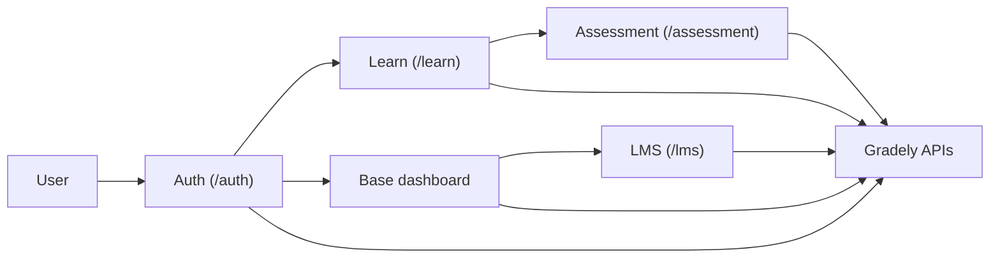

# Legacy micro-frontend map

> Source: draft PR #1, created 2025-09-10. This map captures the intended v2.1 micro-frontend topology. It is retained in the architecture baseline because it is useful context, but deployment, storage, and API details must be verified against the owning repositories before they are treated as a live contract.

## Application map

| App | Repository | Primary audience | Mounted path | Current evidence |
|---|---|---|---|---|
| Auth | `gradely-app-auth` | All users | `/auth` | Verified from `vue.config.js`; Vue 2 |
| Base | `gradely-base-app-2.1` | Tutors and schools | Root / dashboard | Legacy Vue 2 app; route ownership still to verify |
| Learn | `lesson-app` | Students | `/learn` | Verified from `vue.config.js`; Vue 3 |
| Assessment | `student-assessment` | Students and teachers | `/assessment` | Legacy Vue 2 app; route ownership still to verify |
| LMS | `lms` | Schools and teachers | `/lms` | Legacy Vue 2 app; route ownership still to verify |

## Integration assumptions inherited from PR #1

The earlier draft described independently deployed Vue applications that share authentication state and call the v2/v2.1 APIs. Treat these as review prompts, not guarantees:

- confirm the actual local-storage keys, token-refresh owner, and cross-app event behavior;
- confirm app routes and deployment host/path configuration from each repository;
- confirm which API version and base URL each app uses;
- document an API or auth-contract change here before changing more than one app.

## Modernization boundary

`gradely-web-v3.1` is a separate Vue 3/TypeScript monorepo with `learn` and `tutor` applications. Do not assume it uses the same build, shared-state, or deployment approach as the legacy micro-frontends.

## Review checklist for any cross-app change

1. Identify the user role and entry app.
2. Identify the API route and backend owner.
3. Confirm token/session propagation.
4. Test deep links and hard refreshes at the mounted path.
5. Update this map and the central architecture baseline if the contract changes.
