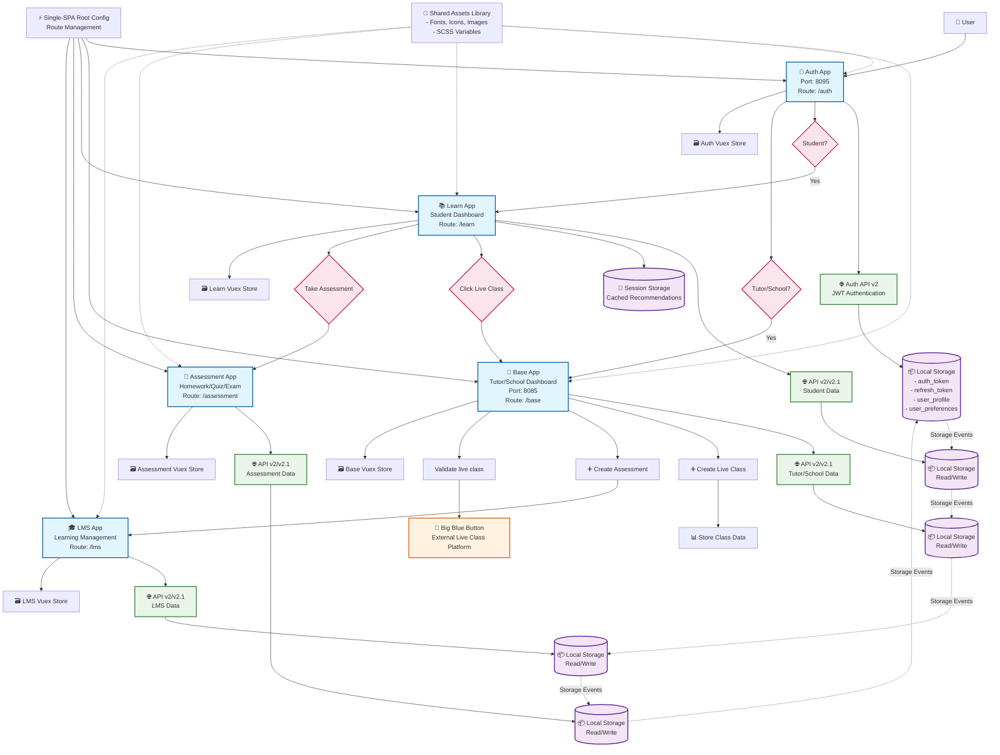

# Gradely Microfrontend Architecture

Gradely is a complete LMS for schools, teachers, parents, and students. Features include lesson planning, assignment creation, grading, progress tracking, and personalized learning plans. Ideal for traditional and alternative learning environments, it supports educators and learners in achieving their goals.

## 🏗️ Architecture Overview

### Technology Stack
- **Framework**: Single-SPA
- **Frontend**: Vue.js + Vue Router + Vuex
- **Backend**: Microservices (REST APIs v2 & v2.1)
- **Authentication**: JWT tokens
- **Deployment**: AWS S3 + CloudFront

### Apps

| App | Purpose | Users | Route | Repo |
|-----|---------|-------|-------|------|
| **Auth** | Authentication & Landing | All | `/auth` | [https://github.com/gradely/gradely-app-auth](https://github.com/gradely/gradely-app-auth) |
| **Base** | Tutor/School Dashboard | Tutors/Schools | `/` (root), `/feed` | [https://github.com/gradely/gradely-base-app-2.1](https://github.com/gradely/gradely-base-app-2.1)|
| **Learn** | Student Dashboard | Students | `/learn` | [https://github.com/gradely/lesson-app](https://github.com/gradely/lesson-app) |
| **Assessment** | Homework/Quiz/Exam Platform | Students/Teachers | `/assessment` | [https://github.com/gradely/student-assessment](https://github.com/gradely/student-assessment) |
| **LMS** | Learning Management System | Schools/Teachers | `/lms` | [https://github.com/gradely/lms](https://github.com/gradely/lms) |

# 
> The diagram below shows how our micro applications communicate...

## 🔄 Communication & Data Flow

### Inter-App Communication
- **Primary Method**: Local Storage (shared domain)
- **Data Shared**: Authentication tokens, user preferences, user profile
- **Caching**: Session storage for recommendations
- **Real-time Sync**: Storage events across applications

### Storage Strategy
- **Local Storage**: User authentication, preferences, tokens
- **Session Storage**: Cached recommendations and temporary data
- **No Key Namespacing**: Direct key sharing across apps

### Routing
- **Independent Routing**: Each app manages its own routes with Vue Router
- **No Cross-App Communication**: Apps don't notify each other of route changes
- **Deep Linking**: Supported within individual applications

## 🔌 Backend Integration

### API Architecture
- **Two API Versions**: v2 and v2.1 running simultaneously
- **Individual Clients**: Each micro app has its own REST client
- **Authentication**: JWT tokens with automatic refresh
- **No Coordination**: Backend calls are independent per micro app

### Authentication Flow
1. User logs in through Auth app
2. JWT tokens stored in local storage
3. All subsequent API calls include Bearer token
4. Token refresh handled by individual clients

## 📁 Shared Resources

### Asset Management
- **Shared Library**: Common fonts, icons, images, and SCSS variables
- **Vue Components**: Reusable UI components across apps
- **Consistent Styling**: Shared design system

### State Management
- **Individual Vuex Stores**: Each app maintains its own store
- **Shared Data Pattern**: Common structure for auth and preferences modules
- **Local Storage Sync**: Vuex stores sync with local storage

## 🚀 Development & Deployment

### Local Development
- **Port Configuration**: Auth (3000), Learn (8098), Assessment (8096), Base (8093), LMS (8092)
- **Independent Development**: Each app runs separately
- **Environment Variables**: Centralized configuration via env.js

### CI/CD Pipeline
- **Git Workflow**: Feature branches → dev → production
- **Trigger**: Git tags (`dev-v[version]`, `dev-v[version]-alpha-[build]`)
- **Deployment**: AWS S3 sync with CloudFront invalidation
- **Exclusions**: Each app deployment excludes other app directories

### Versioning
- Automated versioning through YAML configuration
- Branch-based deployments
- Environment-specific builds

## 👥 User Journeys

### Student Flow
1. Login via Auth app → Redirected to Learn (Student Dashboard)
2. Click Live Class → Redirected to Base for validation → External Big Blue Button
3. Click Assessment → Redirected to Assessment app

### Tutor Flow
1. Login via Auth app → Redirected to Base (Tutor Dashboard)
2. Create Live Class Schedule
3. Click Live Class → Redirected to Base for validation → External Big Blue Button
4. Create Assessment → Redirected to LMS app for management

## 🔧 Key Features

### Authentication
- Role-based redirection after login
- JWT token management across all apps
- Automatic token refresh and error handling

### Data Synchronization
- Real-time preference sync via storage events
- Consistent user state across applications
- Session-based recommendation caching

### External Integrations
- Big Blue Button for live classes
- CkEditor for rich text input

## 🏆 Best Practices

### Communication
- Use storage events for cross-app data updates
- Maintain consistent data structures in local storage
- Handle missing data gracefully

### Development
- Independent app development and testing
- Environment-based configuration management

### Deployment
- Automated CI/CD with proper exclusions
- CloudFront caching invalidation
- Version control through Git tags

## 🐛 Troubleshooting

### Common Issues
- **Cross-App Data**: Verify local storage key consistency
- **Routing**: Ensure proper route isolation
- **Build Failures**: Validate environment variables

---